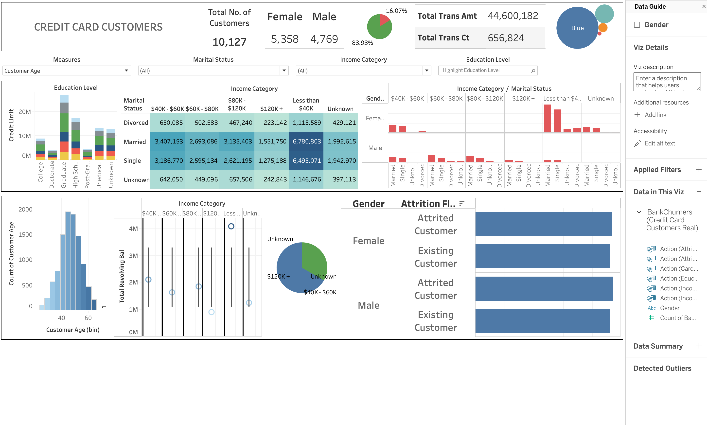
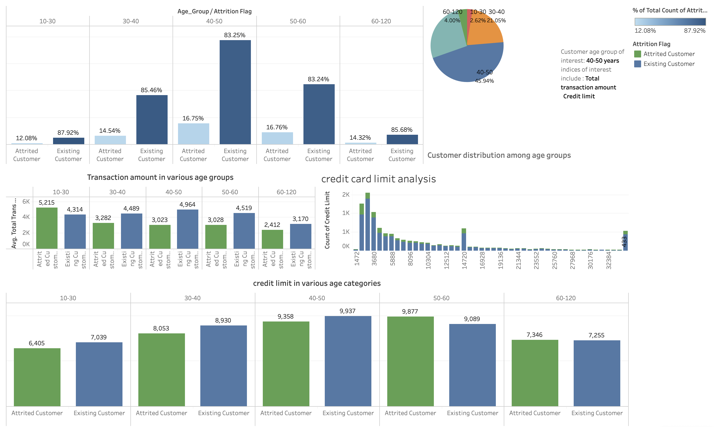

# Credit Card Churn Analysis

## Overview

This project analyzes credit card customer data to understand the key factors influencing customer churn (attrition). Using data science and visualization techniques, the goal is to uncover actionable insights that can help financial institutions improve customer retention and engagement.

---

## Table of Contents

- [Overview](#overview)
- [Motivation](#motivation)
- [Dataset](#dataset)
- [Project Workflow](#project-workflow)
- [Key Findings](#key-findings)
- [How to Run](#how-to-run)
- [Visualizations & Dashboards](#visualizations--dashboards)
- [Conclusion](#conclusion)
- [Contact](#contact)

---

## Motivation

Customer churn is a significant challenge for banks and credit card companies. Retaining existing customers is generally more cost-effective than acquiring new ones. By understanding the drivers of churn, organizations can develop targeted strategies to improve customer satisfaction and loyalty.

---

## Dataset

- **Source:** [Kaggle Credit Card Churn Dataset](https://www.kaggle.com/datasets/sakshigoyal7/credit-card-customers)
- **Features:** Demographics (age, gender, marital status), income and education levels, account information, transaction history, and churn status.

---

## Project Workflow

- Data Cleaning & Preprocessing
- Exploratory Data Analysis (EDA)
- Feature Engineering
- Model Building & Evaluation
- Insights & Recommendations

---

## Key Findings

- Churn rates vary significantly across demographic groups, income categories, and account features.
- Customers with lower engagement (fewer transactions, lower balances) are more likely to churn.
- Certain age groups, especially 40-50 years, show distinct churn patterns.

---

## How to Run

1. **Clone the repository:**
   ```bash
   git clone https://github.com/Saiyyam1003/Credit-card-churn-analysis.git
   ```
2. **Install dependencies:**
   ```bash
   pip install -r requirements.txt
   ```
3. **Open and run the notebook:**
   ```bash
   jupyter notebook DEV_mini.ipynb
   ```

---

## Visualizations & Dashboards

### 1. Credit Card Customers Overview Dashboard

 provides a comprehensive overview of credit card customers, displaying demographic breakdowns (age, gender, marital status), income and education categories, transaction counts and amounts, and churn status by gender. It highlights the proportion of attrited vs. existing customers and visualizes customer distribution across key categories.*

---

### 2. Customer Age Group and Churn Analysis Dashboard

 on customer age groups, showing churn rates, transaction amounts, and credit limits across different age segments. The age group 40-50 years stands out, with detailed comparisons between attrited and existing customers in terms of transaction behavior and credit limits.*

---

## Conclusion

The analysis reveals that customer churn is influenced by a combination of demographic factors, transaction behavior, and account characteristics. Targeted interventions for at-risk segments, especially those identified in the dashboards, can help reduce attrition and improve overall customer retention.


